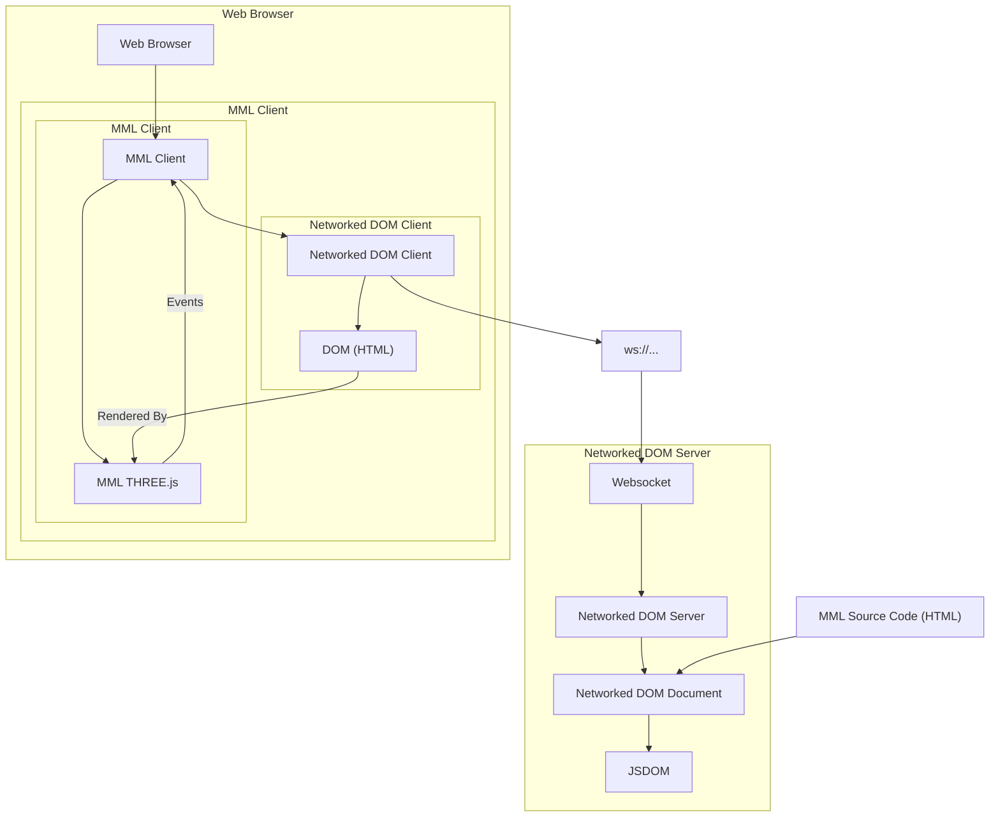

# MML: Metaverse Markup Language

MML is a markup language for describing 3D multi-user interactive Metaversal objects and experiences based on HTML.

### Language

E.g.
```html
<m-cube id="my-cube" color="red"></m-cube>
<script>
    const cube = document.getElementById('my-cube');
    cube.addEventListener('click', () => {
        cube.setAttribute('color', 'blue');
    });
</script>
```

HTML and JavaScript in the form of the DOM (Document Object Model) provide an existing foundation for describing and mutating a hierarchy of elements. MML uses this foundation with new elements and attributes to allow describing 3D concepts.

### Network Model

In the common use case an MML document is run on a server and is observed and interacted with by multiple users.

This capability is achieved by running an MML Document on a server using a library (built expressly for MML) called "Networked DOM". 

The server and network components necessary to support this multi-user mode are independent of the MML additions to HTML (and can be used with regular 2D HTML).

### Combined

The Networked DOM server and MML client can then be used to allow multiple users to interact with the same instance of an object at the same time, and bring these objects into game engines and web virtual world experiences.

## Benefits

* **Familiarity**: MML is based on HTML, the most common way to author documents for the web. This makes it approachable for a wide range of creators.
* **Ecosystem**: the HTML ecosystem is vast, and because MML is based on HTML, creators can take advantage of this existing ecosystem of libraries, frameworks, and learning resources.
* **Portability**: MML documents can run in any modern web browser, making them easy to share and view.
* **Composability**: MML documents can be composed of multiple documents running on different servers, making it possible to create complex virtual world objects without having to provide all the compute power and technical capability on a single server.

# High-Level Package Architecture

## Language (MML)
MML is a set of HTML elements and attributes that can be used to describe 3D objects and experiences.

These elements and attributes can be used without networking. However, when a HTML document including MML tags is run on a server and exposed via a websocket multiple users can interact with the same instance of the document at the same time.

* [./packages/mml-web](./packages/mml-web) - Web THREE.js MML Library
* [./packages/mml-web-client](./packages/mml-web-client) - Web THREE.js MML Client
* [./packages/mml-web-runner](./packages/mml-web-runner) - Web Runner (for running MML documents in a web browser rather than a server)
* [./packages/schema](./packages/schema) - MML Schema in XML Schema Definition Language (XSD)
* [./packages/schema-validator](./packages/schema-validator) - A package for validating MML document using the MML Schema

## Networking (Networked DOM)
MML is based on a set of libraries (built expressly for MML) called "Networked DOM".

The server and network components necessary to support the multi-user mode are independent of the MML additions to HTML (and can be used with regular 2D HTML).

* Networked DOM
  * [./packages/networked-dom-web](./packages/networked-dom-web) - Web Networked DOM Library
  * [./packages/networked-dom-web-client](./packages/networked-dom-web-client) - Web Networked DOM Client
  * [./packages/networked-dom-web-runner](./packages/networked-dom-web-runner) - Web Networked DOM Runner (for running Networked DOM documents in a web browser rather than a server)
  * [./packages/networked-dom-protocol](./packages/networked-dom-protocol) - Networked DOM WebSocket Protocol TypeScript Definition
  * [./packages/networked-dom](./packages/networked-dom) - Networked DOM Wrapper Library
    * Comprised of:
      * [./packages/observable-dom-common](./packages/observable-dom-common) - Observable DOM Common
      * [./packages/observable-dom](./packages/observable-dom) - Observable DOM (JSDOM Execution) Library
      * [./packages/networked-dom-document](./packages/networked-dom-document) - Networked DOM Document Library

# Usage of this repo

This repo contains libraries and schema definitions for MML. The most likely way to use this repo if cloning it is as libraries for other projects.

1. Clone the repo
1. `npm install`
1. `npm run iterate` Builds and starts incrementally building package artefacts from sources
   * Servers should start for examples:
     * [http://localhost:8080](http://localhost:8080) - MML Example Server
     * [http://localhost:8081](http://localhost:8081) - Networked DOM Example Server

To use any of the libraries in this repo in another project, you can use `npm link` to make these dependencies linkable your other npm project.
* `npm run link-all` Runs `npm link` in all would-be-published packages to allow using as local dependencies to develop with. It will also print the commands to link the dependencies.


# Architecture Diagram

The below diagram shows the high-level architecture of the MML system when used in a web browser with the Networked DOM server running an MML document.


